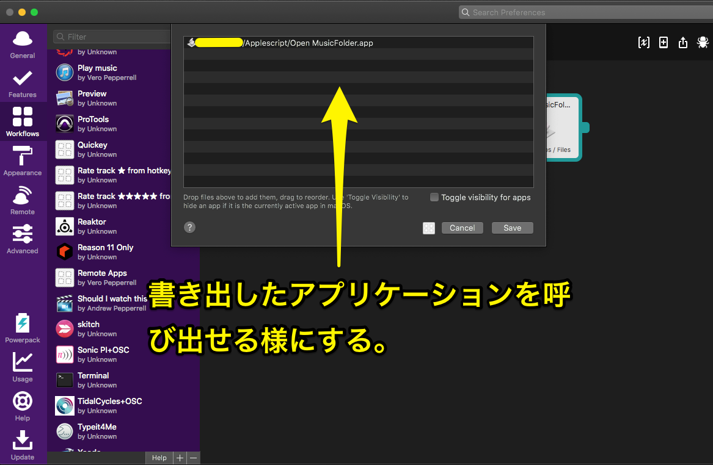
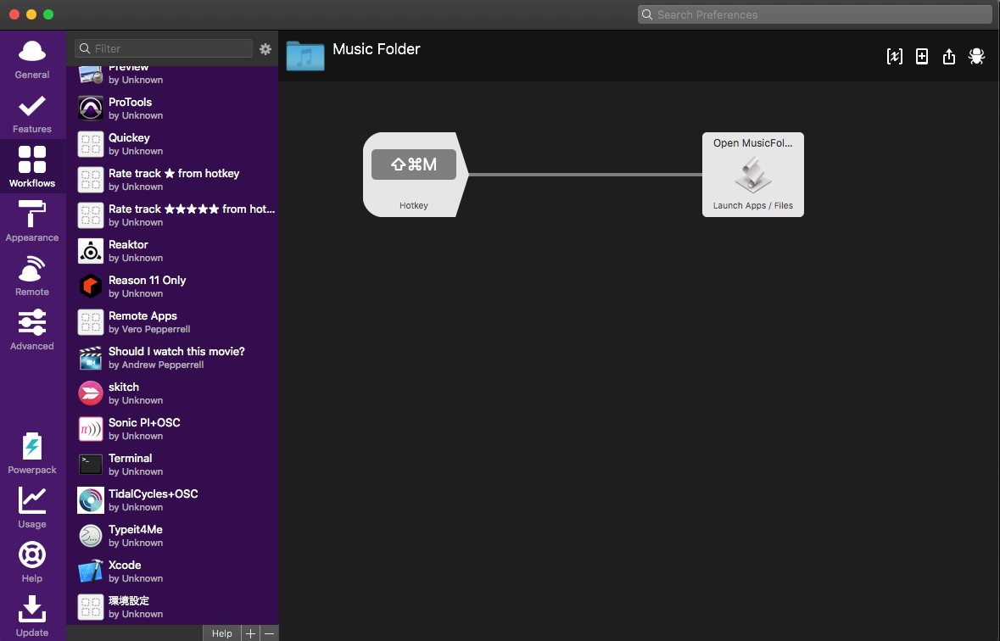

# Go To Music Folder AppleScriptの使い方


以下のyour-usernameの部分はあなたのユーザーネームに変更し動作確認してください。

```
tell application "Finder"

	activate

	--新しい（アプリケーション）フォルダを開く,your-usernameの部分はあなたのユーザーネームに変更して動作確認してください
	open folder "Macintosh HD:Users:your-username:Music"


end tell
```


そして「ファイル＞書き出す」でアプリケーションとして書き出し保存します。（拡張子は.app）


その後、[Alfred](https://www.alfredapp.com/)のWorkflowで先ほど書き出したアプリケーションを好きなコマンドで呼び出せる様に右側は以下の様に設定。




Finderの移動（Go To）メニューは「Shift + Command+アルファベット」なので今回はShift + Command+Mにしました。




とても簡単なものですがApplescript+[Alfred](https://www.alfredapp.com/) で好きなコマンドで


https://www.alfredapp.com/


witten by Atsushi Nakayama a.k.a electrounin

https://electrounin.com/

Twitter : @mekayama


